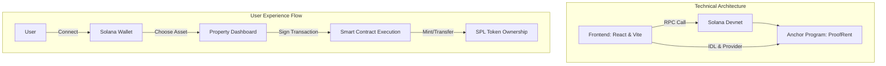

# ProofRent — RWA Rental Protocol on Solana

[](https://github.com/Blaze-09X/proofrent-mvp/actions/workflows/ci.yml)
[](LICENSE)
[](https://solana.com)
[](https://www.anchor-lang.com/)

> Децентрализованный протокол для аренды реальных активов (Real World Assets). Позволяет владельцам токенизировать имущество и сдавать его в аренду через прозрачные смарт-контракты на базе Solana.

[Live Demo](https://blaze-09x.github.io/Solana_Hakaton/) · [Docs](docs/)

---

## 📋 Обзор проекта

ProofRent решает проблему доверия и высоких комиссий при краткосрочной аренде активов. Используя скорость Solana, мы создали MVP, где каждый объект — это верифицированный аккаунт в блокчейне.

### Основные возможности:
- **Mint Property:** Регистрация актива в блокчейне с указанием цены и метаданных.
- **Instant Rent:** Мгновенная аренда с прямой транзакцией владельцу (P2P).
- **Release Logic:** Механика освобождения актива, позволяющая вернуть его в пул доступных.


---

## 🛠 Технологический стек

| Слой | Технология |
|-------|-----------|
| **Smart Contracts** | Rust & Anchor Framework |
| **Frontend** | React & TailwindCSS |
| **Blockchain** | Solana (Devnet) |


---

## 🏗 Архитектура системы



## 📦 Быстрый старт

**Предварительные требования:** Node.js 18+, Rust, Anchor CLI, Solana CLI.

1. **Клонирование и установка:**
   ```bash
   git clone [https://blaze-09x.github.io/Solana_Hakaton/](https://blaze-09x.github.io/Solana_Hakaton/)
   cd proofrent-mvp
   npm install
2. **Сборка смарт-контракта**
    ```bash
    anchor build
    anchor test
3. **Запуск backend и frontend (локально)**
   Запускаем в первом терминале backend, после во втором терминале запускаем frontend:
   ```bash
    npx http-server . -p 3001 -c-1 --cors -P http://localhost:3001
    starting up http-server, serving
## 🗺 Дорожная карта (Roadmap)

- [x] **v1.0 — MVP (Current)**
  - [x] Разработка смарт-контракта на Rust (Anchor).
  - [x] Логика создания (Mint) и аренды (Rent) активов.
  - [x] Базовая интеграция с Phantom Wallet.


  ---
[🚀 Live Demo](https://blaze-09x.github.io/Solana_Hakaton/)
(*обязательно нужно открыть с помощью браузера в котором есть расширение кошелька Phantom Wallet(например, Google Chrome. Microsoft Edge). Предварительно выбрав сеть devnet!)
  ---


## 🤝 Контакты

Разработчики: 
- **Специализация:** Computer Engineering and Software
- **GitHub:** [@Blaze-09X](https://github.com/Blaze-09X), [@Aidana91](https://github.com/Aidana91), [@Aruzhan-kenshbaeva](https://github.com/Aruzhan-kenshbaeva), [tipiitop44-hub](https://github.com/tipiitop44-hub).
- **Проекты:** Blockchain (Solana/Anchor)

---

## 📄 Лицензия

Данный проект распространяется под лицензией **MIT**. 

Полный текст лицензии доступен в файле [LICENSE](./LICENSE). 
